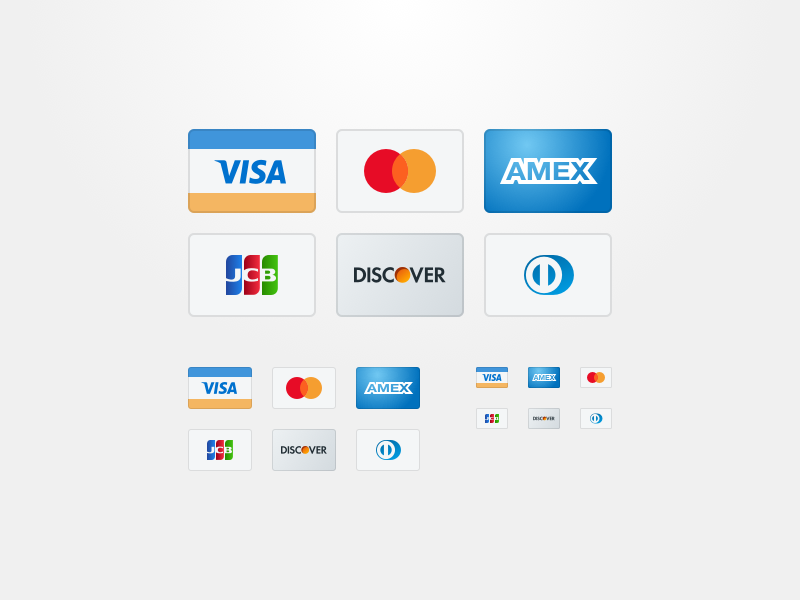
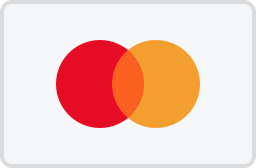

# Credit Card Sprites

Credit card sprites optimized for 128px, 64px and 32px.

---
**32px x 21px**

---
**64px x 42px**

---
**128px x 84px**

 

| Width | Height |
| --- | --- |
| 32 | 21 |
| 64 | 42 |
| 128 | 84 |

_A 256 size is available to allow a 2x resolution size for 128._
